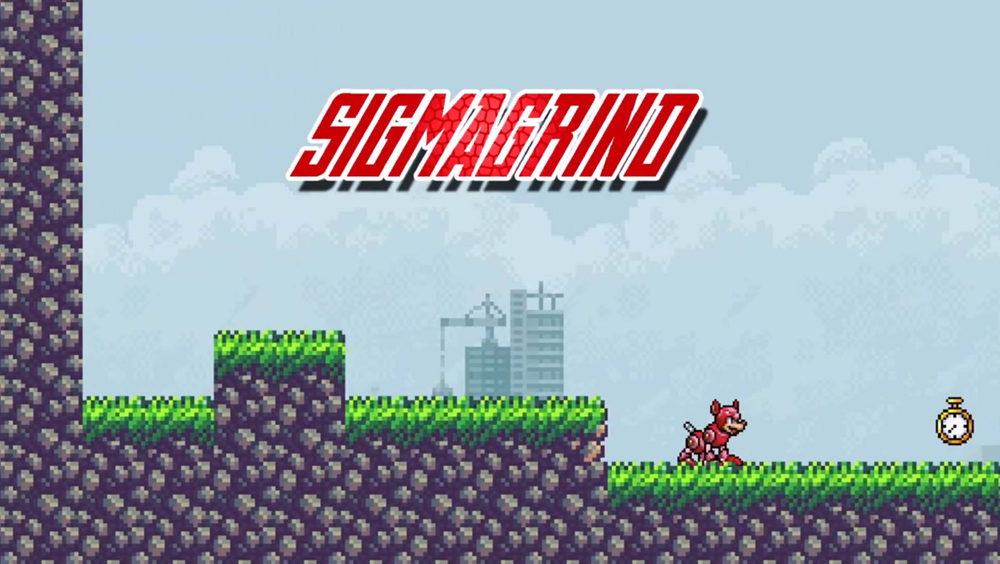

  # Sigma Grind
  
  ## Table of contents:
  1. [Project Description](#Project-Description)
  1. [Installation](#Installation-Instructions)
  1. [Controls](#Controls)
  1. [How to Contribute](#How-to-Contribute)
  1. [Questions](#Questions)
  1. [Contact Creators](#Contact-Us)

  ## Project Description:
Sigma Grind is an action packed, movement-based platformer where you run, jump, dash and slash your way through 3 unique levels, face 3 unique and challenging bosses, and race against your friends to do it all in the fastest time possible. Play through action packed levels wrapped in a nostalgic MegaMan aesthetic. Do you have what it takes to slash your way through the competition and take on the title of Sigma?

  ### Trailer:
https://www.youtube.com/watch?v=Qkf74Izk0QM
  ### Gameplay:
  <!-- 
  
  \
  ; -->
  ## Installation Instructions:
  [Click Here To Play!](https://apotafiy.github.io/sigma-grind/)
  ## Controls
  Your four legged friend Rush will teach you everything you need to know! 
  But Just in case, here is a cheat sheet!
  * A:&nbsp;&nbsp;&nbsp;&nbsp;&nbsp;&nbsp;&nbsp;&nbsp;&nbsp;&nbsp;&nbsp;&nbsp;&nbsp;&nbsp;Left
  * D:&nbsp;&nbsp;&nbsp;&nbsp;&nbsp;&nbsp;&nbsp;&nbsp;&nbsp;&nbsp;&nbsp;&nbsp;&nbsp;&nbsp;Right
  * Space:&nbsp;&nbsp;&nbsp;&nbsp;&nbsp;&nbsp;&nbsp;Jump 
  * J:&nbsp;&nbsp;&nbsp;&nbsp;&nbsp;&nbsp;&nbsp;&nbsp;&nbsp;&nbsp;&nbsp;&nbsp;&nbsp;&nbsp;&nbsp;Attack
  * K:&nbsp;&nbsp;&nbsp;&nbsp;&nbsp;&nbsp;&nbsp;&nbsp;&nbsp;&nbsp;&nbsp;&nbsp;&nbsp;&nbsp;Dash
  * S + J:&nbsp;&nbsp;&nbsp;&nbsp;&nbsp;&nbsp;&nbsp;&nbsp;Pogo

| Button        |Action     |
|    :----:     |          :---: |
| A             | Left    |
| D             |Right      |
| Space         | Jump      |
| J             | Attack     |
| K             | Dash   
| S + J         | Pogo     |

  ## Built With
  * JavaScript
  * HTML
  * CSS
  * Love and Care
  ## How to Contribute:
  * Want to make your own levels? Check out the [level builder](https://github.com/treguv/sigma-grind-level-builder).
  * Checkout the GitHub repo and please raise any issues with Sigma Grind you may come across.
  * New feature ideas? Fork the project and implement it!
  * Follow the code of conduct for contribution outlined in [Contributor Covenant](https://www.contributor-covenant.org/) 

  ## Questions
  Feel free to reach out either in the projects GitHub page or send an email to us!
  ### Github page:
  [GitHub Repository](https://github.com/apotafiy/sigma-grind)
  ### Contact Us:
   [Artem Potafiy](https://github.com/apotafiy)

  [Lam Mai](https://github.com/lammai)

  [Daniel Jiang](https://github.com/imdanieljiang)

  [Vlad Tregubov](https://github.com/treguv)